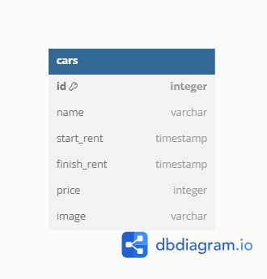

# Car Management Dashboard API
Hi read me pls :)


## ERD (Entity Relationship Diagram)




## API Reference

#### Get all cars

```http
  GET /api/v1/cars
```

| Parameter | Type     | Description                |
| :-------- | :------- | :------------------------- |
| `api_key` | `string` | **Required**. Your API key |

#### Get car

```http
  GET /api/v1/cars/${id}
```

| Parameter | Type     | Description                       |
| :-------- | :------- | :-------------------------------- |
| `id`      | `string` | **Required**. Id of item to fetch |

#### Add car

```http
  POST /api/v1/cars/${id}
```

| Payload | Type     | Description                       |
| :-------- | :------- | :-------------------------------- |
| `body`      | `form-data` | **Required**. Request body of item to update |


#### Delete car

```http
  DELETE /api/v1/cars/${id}
```

| Parameter | Type     | Description                       |
| :-------- | :------- | :-------------------------------- |
| `id`      | `string` | **Required**. Id of item to delete |

#### Update/Edit car

```http
  PUT /api/v1/cars/${id}
```

| Parameter | Type     | Description                       |
| :-------- | :------- | :-------------------------------- |
| `id`      | `string` | **Required**. Id of item to update |

| Payload | Type     | Description                       |
| :-------- | :------- | :-------------------------------- |
| `body`      | `form-data` | **Required**. Request body of item to update |

